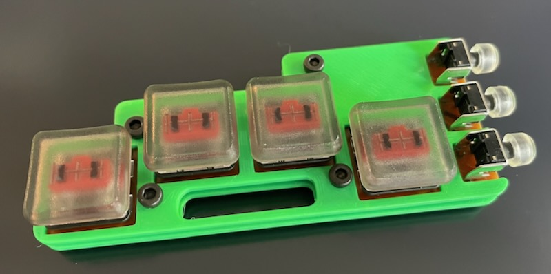
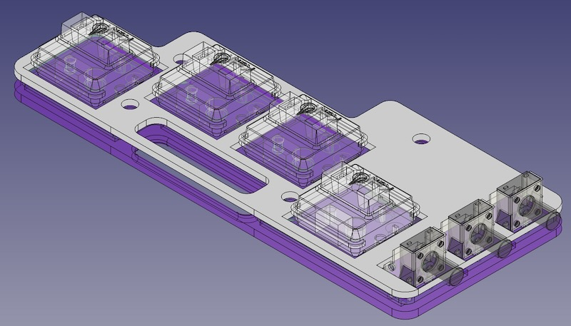
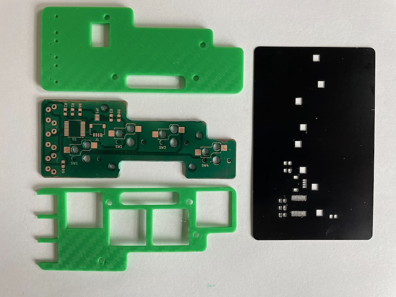

# c7k-keychain
super thin I2C keyboard

Chording 7 Key - I2C breakout

Ultra-Thin wearable one handed keyboard which can be used with a phone, tablet, computer even from a pocket. It is a full size keybaord in seven buttons.

I2C interface means easy connectivity to modern micrcontrollers and single board computers. This allows maximum flexibility for direct to controller, HID USB or HID BLE interfacing.






```
| Key | Pinky | Ring | Middle | Index | Thumb |
|-----|-------|------|--------|-------|-------|
| a   | x     |      |        |       |       |
| b   | x     |      |        |       | oxo   |
| c   | x     |      |        | x     |       |
| d   |       | x    | x      | x     |       |
| e   |       |      | x      |       |       |
| f   |       | x    | x      |       | oxo   |
| g   |       |      | x      |       | oxo   |
| h   |       | x    |        |       | oxo   |
| i   |       |      | x      |       |       |
| j   |       | x    | x      | x     | oxo   |
| k   | x     |      | x      |       | oxo   |
| l   | x     |      | x      |       |       |
| m   |       |      |        | x     | oxo   |
| n   |       | x    | x      |       |       |
| o   |       | x    |        | x     |       |
| p   | x     | x    | x      |       |       |
| q   | x     | x    | x      | x     | oxo   |
| r   |       |      | x      | x     |       |
| s   | x     |      |        |       |       |
| t   | x     | x    |        |       |       |
| u   | x     | x    | x      | x     |       |
| v   | x     | x    |        |       | oxo   |
| w   |       | x    |        | x     | oxo   |
| x   | x     |      |        | x     | oxo   |
| y   |       |      | x      | x     | oxo   |
| z   | x     | x    | x      |       | oxo   |
```

```
| Key   | Pinky | Ring | Middle | Index | Thumb |
|-------|-------|------|--------|-------|-------|
| ONE   |       |      |        | x     | oox   |
| TWO   |       |      | x      |       | oox   |
| THREE |       | x    |        |       | oox   |
| FOUR  | x     |      |        |       | oox   |
| FIVE  |       |      | x      | x     | oox   |
| SIX   |       | x    | x      |       | oox   |
| SEVEN | x     | x    |        |       | oox   |
| EIGHT |       | x    |        | x     | oox   |
| NINE  | x     |      | x      |       | oox   |
| ZERO  |       | x    | x      | x     | oox   |
```

```
| Key            | Pinky | Ring | Middle | Index | Thumb |
|----------------|-------|------|--------|-------|-------|
| period         |       |      | x      |       | xoo   |
| comma          |       |      | x      | x     | xoo   |
| forward_slash  | x     | x    |        |       | xoo   |
| grave_accent   | x     | x    | x      | x     | xoo   |
| minus          | x     |      |        |       | xoo   |
| equals         |       |      | x      | x     | xoo   |
| left_bracket   | x     |      | x      |       | xoo   |
| right_bracket  | x     |      |        | x     | xoo   |
| backslash      | x     | x    |        |       | xoo   |
| semicolon      | x     | x    | x      |       | xoo   |
| quote          | x     |      | x      | x     | xoo   |
| backspace      |       | x    | x      |       | xoo   |
```

```
| Modifier        | Pinky | Ring | Middle | Index | Thumb |
|-----------------|-------|------|--------|-------|-------|
| Toggle Modifier |       |      |        |       | xxo   |
| Shift           | x     |      |        |       |       |
| Control         |       | x    |        |       |       |
| Alt             |       |      | x      |       |       |
| GUI             |       |      |        | x     |       |
```

```
| Action       | Pinky | Ring | Middle | Index | Thumb |
|--------------|-------|------|--------|-------|-------|
| Toggle Mouse |       |      |        |       | oxx   |
| Move Up      | x     |      |        |       |       |
| Move Right   |       | x    |        |       |       |
| Move Left    |       |      | x      |       |       |
| Move Down    |       |      |        | x     |       |
```
